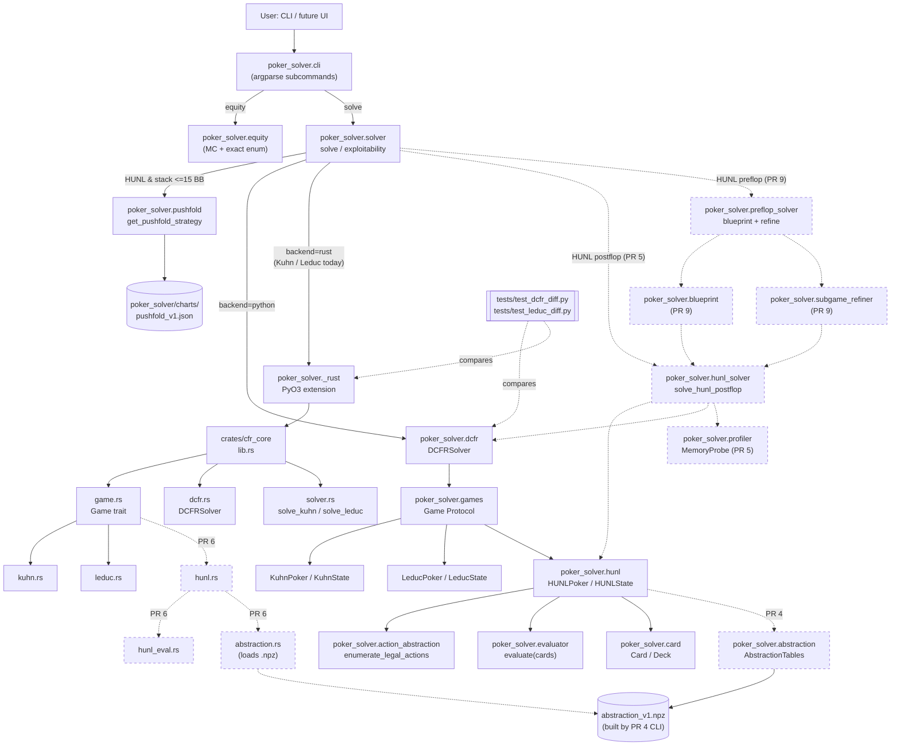
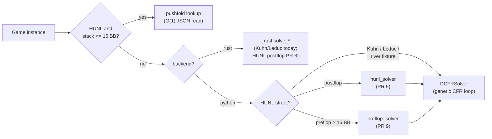
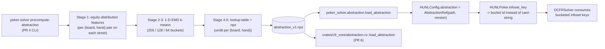

# Architecture

This document gives a visual + tabular orientation to the poker_solver codebase. It complements PLAN.md §3 (which lists the directory tree) by showing the **dispatch composition**, **data flow**, and **control flow** that PLAN.md only summarises. Future-state modules (PR 4+) are clearly marked.

The codebase ships as two physical tiers — Python reference (`poker_solver/`) and Rust production (`crates/cfr_core/`, exposed as `poker_solver._rust`) — with a third future-state tier for the UI (`ui/`, lands PR 10). Every algorithmic decision lives in Python first; Rust is a structural port gated by differential tests. The pattern matches Noam Brown's own `noambrown/poker_solver` (`cpp/` + `python/`).

---

## 1. High-level diagram

The diagram below traces every user-visible entry point through dispatch, into the two algorithmic tiers, down to the data files the solvers consume. Solid boxes are current code; dashed-style annotations call out future-state modules.



Key invariants the diagram encodes:

- **Single front door:** `solver.solve()` is the only orchestration function. It dispatches by `(game type, stack depth, backend)`; users never wire `DCFRSolver` directly.
- **Game protocol contract:** every solver-consumable game (Kuhn, Leduc, HUNL today; multi-player tomorrow) implements `poker_solver.games.Game` (Python `Protocol`) or `crates::cfr_core::game::Game` (Rust trait). The DCFR loop is game-agnostic.
- **Abstraction is opt-in:** `HUNLConfig.abstraction` defaults to `None`. With no abstraction artifact attached, `HUNLPoker.infoset_key` returns the lossless card-string form (PR 3 behaviour); with an artifact attached, it emits bucket ids (PR 4 behaviour). The river-only `default_tiny_subgame` runs lossless.
- **Differential test gate:** `tests/test_dcfr_diff.py` (Kuhn) and `tests/test_leduc_diff.py` walk both tiers on the same game and assert per-action agreement within 1e-4. Future diff tests (PR 6 HUNL, PR 7 vs Noam Brown's river solver) extend the same pattern.

---

## 2. Module-by-module map

### 2.1 Python tier (`poker_solver/`)

| Module | Summary | Key types / entry points | Introduced |
|---|---|---|---|
| `__init__.py` | Public API re-exports; `__version__` | re-exports | PR 0 |
| `card.py` | 52-card primitives, deck, parsers | `Card`, `Deck`, `RANKS`, `SUITS`, `card_to_int`, `int_to_card`, `parse_card`, `parse_hand`, `parse_board`, `full_deck` | PR 0 |
| `evaluator.py` | 5/7-card hand evaluator (tuple-ordered) | `evaluate(cards) -> tuple[int, ...]`, `HandRank` | PR 0 |
| `equity.py` | Equity calc; auto-dispatch exact / MC | `equity(...)`, `EquityResult`, `DEFAULT_ITERATIONS` | PR 0 |
| `range.py` | Range-syntax parser | `Range`, `parse_range`, `Combo` | PR 0 |
| `cli.py` | argparse CLI; `equity` + `solve` subcommands | `build_parser`, `main` | PR 0/1, extended each PR |
| `games.py` | `Game` protocol + Kuhn + Leduc + Nash oracle | `Game`, `KuhnPoker`, `KuhnState`, `LeducPoker`, `LeducState`, `kuhn_nash_value` | PR 1 / PR 2 |
| `dcfr.py` | Discounted CFR (Brown & Sandholm 2019), numpy reference | `DCFRSolver`, `InfosetData` | PR 1 |
| `solver.py` | Orchestration: dispatch chart / Python / Rust; exploitability + BR | `solve`, `exploitability`, `SolveResult`, `_solve_pushfold_lookup`, `_solve_rust` | PR 1, extended PR 3.5 |
| `hunl.py` | HUNL state, tree, infoset key, chance enumeration | `HUNLPoker`, `HUNLState`, `HUNLConfig`, `Street`, `default_tiny_subgame` | PR 3 |
| `action_abstraction.py` | Bet-size menu, raise-cap enforcement | `ActionContext`, `ActionAbstractionConfig`, `enumerate_legal_actions`, `compute_bet_amount`, `compute_raise_to`, 14 `ACTION_*` constants | PR 3 |
| `pushfold.py` | Short-stack chart lookup (2-15 BB) | `get_pushfold_strategy`, `get_full_range`, `is_pushfold_mode`, `PushFoldChartUnavailable`, `PUSHFOLD_MIN_BB`, `PUSHFOLD_MAX_BB` | PR 3.5 |
| `charts/__init__.py` | Data-only package init (importlib.resources anchor) | (no code) | PR 3.5 |
| `charts/pushfold_v1.json` | Generated SB-jam / BB-call charts at 2-15 BB | (data) | PR 3.5 |
| `_rust.cpython-313-darwin.so` | Compiled PyO3 extension (built by maturin) | `_version`, `solve_kuhn`, `solve_leduc` | PR 1 / PR 2 |
| `abstraction/__init__.py` | EMD bucket pipeline package | `lookup_bucket`, `AbstractionTables`, `AbstractionRef`, `load_abstraction`, `save_abstraction`, `build_abstraction` | PR 4 (future) |
| `abstraction/equity_features.py` | Stage 1: per-hand equity-distribution histograms | `compute_river_features`, `compute_turn_features`, `compute_flop_features` | PR 4 (future) |
| `abstraction/emd_clustering.py` | Stages 2-3: 1-D EMD + k-means | `emd_1d`, `kmeans_emd` | PR 4 (future) |
| `abstraction/buckets.py` | Stages 4-5: lookup table + .npz I/O | `AbstractionTables`, `load_abstraction`, `save_abstraction`, `lookup_bucket` | PR 4 (future) |
| `abstraction/precompute.py` | `precompute-abstraction` CLI entry | `build_abstraction` | PR 4 (future) |
| `hunl_solver.py` | HUNL postflop solve orchestration + profiler wiring | `solve_hunl_postflop`, `HUNLSolveResult` | PR 5 (future) |
| `profiler/__init__.py` | Memory profiler package | (re-exports) | PR 5 (future) |
| `profiler/memory.py` | Per-street memory introspection | `MemoryProbe`, `MemoryReport`, `StreetMemoryEntry` | PR 5 (future) |
| `blueprint.py` | Coarse-menu preflop blueprint pass | `build_blueprint`, `BlueprintResult` | PR 9 (future) |
| `preflop_solver.py` | Preflop dispatch + blueprint + refinement orchestration | `solve_hunl_preflop`, `PreflopSolveResult` | PR 9 (future) |
| `subgame_refiner.py` | Per-subgame refinement against blueprint warm-start | `refine_subgame`, `SubgameKey`, `SubgameRefinementResult` | PR 9 (future) |
| `library/` | SQLite-backed solved-spot library | `Library`, `SpotMetadata`, `SpotDescription` | PR 11 (future) |

### 2.2 Rust tier (`crates/cfr_core/`)

The crate ships as a single `cdylib` named `_rust` (per `Cargo.toml`), loaded into Python as `poker_solver._rust`. Public surface is the PyO3 `#[pyfunction]` set in `lib.rs`.

| File | Summary | Key types / entry points | Introduced |
|---|---|---|---|
| `Cargo.toml` | Crate manifest; pyo3 0.23 extension-module feature | — | PR 1 |
| `src/lib.rs` | PyO3 module entry; `solve_kuhn`, `solve_leduc` bindings | `_rust` module, `solve_output_to_py` | PR 1 / PR 2 |
| `src/game.rs` | Generic `Game` trait (mirrors Python `Game` protocol) | `trait Game` | PR 2 |
| `src/dcfr.rs` | DCFR solver, generic over `G: Game`; lazy-discount; HashMap<String, InfosetData> | `DCFRSolver<G>`, `InfosetData` | PR 1 |
| `src/solver.rs` | Solve orchestration + BR-to-fixed-point + game-value; emits `SolveOutput` | `SolveOutput`, `solve_kuhn`, `solve_leduc`, `solve_generic<G>`, `expected_value<G>`, `exploitability<G>` | PR 1 |
| `src/kuhn.rs` | Kuhn state + `impl Game for KuhnState` | `KuhnState` | PR 1 |
| `src/leduc.rs` | Leduc state + `impl Game for LeducState` | `LeducState` | PR 2 |
| `src/hunl.rs` | HUNL state + `impl Game for HUNLState`; mirrors `poker_solver/hunl.py` | `HUNLState`, `HUNLConfig`, `Street` | PR 6 (future) |
| `src/hunl_eval.rs` | Native 7-card evaluator (Rust port of Python `evaluator.py`) | `evaluate` | PR 6 (future) |
| `src/abstraction.rs` | `.npz` loader + `lookup_bucket` (Rust mirror of PR 4 artifact) | `AbstractionTables`, `load_abstraction`, `lookup_bucket` | PR 6 (future) |
| `src/tree.rs` | Compact flat-array indexed tree (perf-tier representation) | `TreeNode`, traversal helpers | PR 6 / PR 8 (future) |
| `src/simd.rs` | NEON 128-bit f64 intrinsics; cache-blocked SoA infoset storage | `Vec4f64`, vectorised DCFR ops | PR 8 (future) |
| `src/preflop.rs` | Rust preflop tree (port of `blueprint.py`/`preflop_solver.py`) | `PreflopState`, `solve_preflop_rust` | PR 9 (future) |
| `src/blueprint.rs` | Rust blueprint solver | `build_blueprint_rust` | PR 9 (future) |
| `src/subgame.rs` | Rust subgame refiner (wraps PR 6 postflop port) | `refine_subgame_rust` | PR 9 (future) |

### 2.3 UI tier (`ui/`) — entirely future

PR 10 introduces the UI as a sibling package outside `poker_solver/` so the engine has zero NiceGUI overhead in headless / CI usage.

| File | Summary | Key types / entry points | Introduced |
|---|---|---|---|
| `__init__.py` | Package init; `__version__` | — | PR 10 (future) |
| `app.py` | NiceGUI `@ui.page('/')` builder; `launch(port, host, dark_mode)` | `launch` | PR 10 (future) |
| `state.py` | Module-level singletons; `Spot`, `RangeWithFreqs`, `SolveSession`, `SolveTree`; background solve runner | `state`, `solver_runner` | PR 10 (future) |
| `views/spot_input.py` | Board picker + 13x13 range matrix input + stacks | `render(state)` | PR 10 (future) |
| `views/run_panel.py` | Bet-size menu + raise caps + iterations + run/pause/stop + live exploitability chart | `render(state, on_solve, ...)` | PR 10 (future) |
| `views/range_matrix.py` | 13x13 strategy heatmap (the visual centerpiece); combo inspector | `render(state)` | PR 10 (future) |
| `views/tree_browser.py` | Lazy decision-tree browser; reach-probability filter | `render(state)` | PR 10 (future) |
| `views/library_browser.py` | PR 11 library dialog (stub in PR 10; real loader in PR 11) | `open_dialog(state)` | PR 10 (future) |

### 2.4 Test tier (`tests/`)

Tests split into four categories. Current test files (listed); future ones noted in PR specs only.

| File | Category | Coverage |
|---|---|---|
| `test_card.py` | Unit | Card / Deck / parsers |
| `test_evaluator.py` | Unit | 5/7-card hand-rank evaluator |
| `test_equity.py` | Unit | Exact + Monte Carlo equity dispatch |
| `test_range.py` | Unit | Range parser |
| `test_dcfr_core.py` | Unit | `DCFRSolver` internals on Kuhn |
| `test_kuhn_dcfr.py` | Intuition | Kuhn Nash value `-1/18` |
| `test_leduc_core.py` | Unit | Leduc state machine |
| `test_leduc_dcfr.py` | Unit | Leduc convergence |
| `test_leduc_intuition.py` | Intuition | MDF / polarization / range structure heuristics |
| `test_hunl_core.py` | Unit | HUNL state, infoset key, chance, terminals, utility |
| `test_hunl_tree.py` | Unit | Tree enumeration + raise-cap + force-all-in invariants |
| `test_action_abstraction.py` | Unit | Bet/raise enumeration + cap + duplicate-fraction handling |
| `test_pushfold.py` | Unit + Intuition | Chart-cell shape, landmark hands (e.g. `72o` never jams >=6 BB, BB calls ~67% at 4 BB) |
| `test_dcfr_diff.py` | Differential | Python `DCFRSolver` vs Rust `solve_kuhn` byte-equivalence |
| `test_leduc_diff.py` | Differential | Python vs Rust on Leduc |
| `test_hunl_postflop_solve.py` | Integration | PR 5 fixtures (future) |
| `test_memory_profiler.py` | Unit | `psutil` RSS calibration (PR 5 future) |
| `test_abstraction_*.py` | Unit + Integration | EMD / k-means / lookup / round-trip (PR 4 future) |
| `test_noambrown_river_parity.py` | Differential | Python vs Brown's MIT river solver (PR 7 future) |
| `test_hunl_preflop_*.py` | Integration | Blueprint + refinement + PR 3.5 handoff (PR 9 future) |
| `test_ui_smoke.py` | UI smoke | PR 10 future |

### 2.5 Top-level + supporting directories

| Path | Purpose |
|---|---|
| `PLAN.md` | Canonical decision log, locked decisions, PR roadmap |
| `pyproject.toml` | Python build config (maturin backend); ruff + mypy + pytest config |
| `Cargo.toml` (root) | Workspace manifest (`members = ["crates/cfr_core"]`) |
| `LICENSE` | MIT |
| `README.md` | High-level user-facing overview |
| `scripts/check_pr.sh` | Pre-merge gate: pytest + cargo test + clippy + ruff + mypy + diff tests + license audit + perf check |
| `scripts/setup_references.sh` | Idempotent reference clone (papers + repos) |
| `scripts/generate_pushfold_charts.py` | Builds `poker_solver/charts/pushfold_v1.json` from in-process DCFR |
| `references/papers/`, `references/code/`, `references/blog/`, `references/products/` | Local-only reference cache; gitignored in `code/` |
| `docs/` | Architecture (this file), competitor landscape, PR-prep specs, runbooks |

---

## 3. Data flow

Three load-bearing data flows in the codebase, each grounded in a real call path.

### 3.1 Solve dispatch (current + future)

`poker_solver.solver.solve()` is the only orchestrator. Routing logic, in order:

1. **Short-stack chart lookup.** If `isinstance(game, HUNLPoker) and is_pushfold_mode(starting_stack, big_blind)`, dispatch to `_solve_pushfold_lookup(config)` which reads `charts/pushfold_v1.json` and returns a `SolveResult` with `backend="pushfold"`. Zero iterations of CFR run.
2. **Rust tier (current: Kuhn + Leduc).** If `backend == "rust"`, route by game type — `KuhnPoker` -> `_rust.solve_kuhn`, `LeducPoker` -> `_rust.solve_leduc`. Other games raise `NotImplementedError` and the caller falls back to Python.
3. **Python tier (default).** Build a `DCFRSolver(game)`, run `iterations` of DCFR with optional `log_every` exploitability snapshots, package into a `SolveResult` with `backend="python"`.

Future extensions (each documented in the corresponding PR spec):

- **PR 5:** HUNL postflop spots route to `hunl_solver.solve_hunl_postflop`, which validates the config (postflop only), attaches PR 4 abstraction tables, wraps `DCFRSolver` with `MemoryProbe`, and emits `HUNLSolveResult`.
- **PR 6:** Same dispatch but `backend="rust"` for HUNL postflop hits `_rust.solve_hunl_postflop`.
- **PR 9:** `Street.PREFLOP` + `stack_bb > 15` routes to `preflop_solver.solve_hunl_preflop`. Stacks `<= 15` keep going to PR 3.5's chart lookup. Stacks `> 250` raise `ValueError`.



### 3.2 Differential testing (Python <-> Rust)

The diff test pattern is the architectural keystone — it's what justifies maintaining two tiers. The flow is identical for Kuhn (`test_dcfr_diff.py`) and Leduc (`test_leduc_diff.py`); PR 6 (HUNL diff) and PR 7 (vs Noam Brown) extend the same shape.

```
1. Build identical (game, alpha=1.5, beta=0, gamma=2.0, iterations=N) inputs
2. Python:  DCFRSolver(game).solve(N)      -> avg_strategy_py
3. Rust:    _rust.solve_kuhn(N, 1.5, 0, 2) -> avg_strategy_rs  (via PyO3)
4. Per-infoset: assert per-action probs agree within 1e-4
   (HashMap iteration order may differ; sort by infoset_key first)
5. Recompute exploitability via Python BR machinery on both outputs;
   assert they agree (sanity check; Rust's internal exploitability has
   ~1e-4 jitter from HashMap-ordered FP accumulation, which is why
   _solve_rust in solver.py re-derives it via the Python reference)
```

Tolerance for HUNL diff (PR 6+) is wider (`5e-3` per-action, `1e-3` per-spot game value) because the larger trees accumulate more FP noise. PR 7 (vs Brown's binary) holds the same bar against an external implementation.

### 3.3 Bucket precompute -> load -> lookup (PR 4 future)



`AbstractionRef` (not `AbstractionTables`) is what crosses the PyO3 boundary, per the PR 4/PR 6 consistency-review resolution: the Rust loader needs only `(source_path, version)` and materialises tables on its own side rather than serialising up to 750 MB across FFI.

### 3.4 Push/fold chart generation (PR 3.5, already shipped)

```
scripts/generate_pushfold_charts.py
    builds a tiny shove-or-fold HUNL game per stack depth (2..15 BB)
    runs DCFRSolver in-process at high iterations
    aggregates per-hand-class jam/call frequencies (suit-isomorphism reduction)
    writes JSON to poker_solver/charts/pushfold_v1.json

poker_solver.pushfold (runtime)
    lazy-loads the JSON via importlib.resources (cached with lru_cache)
    canonicalizes the user's hand class ("ako" -> "AKo")
    returns frequency in [0.0, 1.0]
```

The generator is the solver eating its own dogfood — every chart cell is a DCFR equilibrium of the engine itself, which means publishing the charts also smoke-tests DCFR convergence at the smallest non-trivial HUNL configurations.

---

## 4. Control flow: a single `poker-solver solve` invocation

End-to-end trace for `poker-solver solve --game hunl --hunl-mode tiny_subgame --backend python -n 5000`:

```
1. cli.main(argv)
     -> build_parser().parse_args(argv) yields Namespace(cmd='solve', game='hunl',
        hunl_mode='tiny_subgame', iterations=5000, backend='python', seed=None)
     -> args.func == _cmd_solve

2. _cmd_solve(args)
     -> game = _GAMES['hunl'](args) -> _build_hunl_with_args(args)
        -> mode == 'tiny_subgame' -> HUNLPoker(default_tiny_subgame())
        -> HUNLConfig has starting_street=Street.RIVER, board pre-dealt,
           initial_hole_cards set, no abstraction
     -> result = solve(game, iterations=5000, backend='python')

3. solve(game, iterations, backend='python', **dcfr_kwargs)
     -> is_pushfold_mode(1000, 100) -> 1000/100 == 10 BB, in [2,15] -> True
        WAIT — default_tiny_subgame stacks=1000 with big_blind=100. The check
        path SHORTCIRCUITS to _solve_pushfold_lookup.
        (Pedagogically interesting: the tiny river-only fixture happens to
        sit inside the push/fold band, so the user-facing dispatch lands on
        the chart, not on DCFR. Callers that want to exercise DCFR on the
        tiny subgame should construct an HUNLConfig with stacks > 15 BB OR
        bypass solve() by instantiating DCFRSolver(game) directly.
        See _solve_pushfold_lookup for the shortcut behaviour.)

4. The non-shortcircuit path (e.g. backend='python', deeper stacks):
     -> DCFRSolver(game, alpha=1.5, beta=0.0, gamma=2.0)
     -> per chunk (size = log_every or full):
          solver.solve(step)
            -> for _ in step iterations:
                 self.iteration += 1
                 _cfr(initial_state, reach=ones, iteration)
                   -> if terminal: return utility
                   -> if chance: sum over chance_outcomes recursively
                   -> else:
                        key = game.infoset_key(state, player)
                        info = _get_infoset(key, num_actions)
                        _discount(info, iteration)  # lazy catch-up
                        strategy = _get_strategy(info)  # regret matching
                        recurse per action with updated reach
                        accumulate regret_delta = opp_reach * (av - nv)
                        accumulate strategy_sum += own_reach * strategy
        if log_every: history.append(exploitability(game, avg_strategy))
     -> avg = solver.average_strategy()
     -> value = _game_value(game, avg)
     -> SolveResult(average_strategy=avg, history, value, iterations, backend='python')

5. _cmd_solve continues
     -> prints game / backend / iterations / game value / final exploitability
     -> prints sorted infoset_key -> probability table
```

The `exploitability` and `_best_response_value` helpers in `solver.py` are themselves load-bearing — they run a **best-response-to-fixed-point** loop over the same `Game` protocol, so the same code computes exploitability for any current or future game.

---

## 5. Extension points

Adding new functionality should hit exactly one of these well-defined seams:

| What you want to add | Where it goes | Pattern to follow |
|---|---|---|
| **New game** (e.g. short-deck Hold'em, 6+ Hold'em) | New module in `poker_solver/`; implement the `Game` protocol; add a Rust mirror under `crates/cfr_core/src/` if perf-sensitive | `games.py::LeducPoker` and `leduc.rs` are the cleanest template |
| **New CFR variant** (CFR+, MCCFR, External Sampling) | New class alongside `DCFRSolver` in `dcfr.py`; share the per-iteration walk but swap the regret update | Keep DCFR unchanged; add as `class CFRPlusSolver` parallel to `DCFRSolver` and parameterise `solve()` via a `solver_cls` kwarg |
| **New action abstraction** (e.g. add 50%-pot, drop 200%-pot per node) | `action_abstraction.py`: extend `ActionAbstractionConfig.bet_size_fractions` per-node via `HUNLConfig.bet_size_fractions` | Already parametric; just pass a different tuple |
| **New card abstraction** (OCHS, EHS-squared) | New module under `poker_solver/abstraction/`; conform to `AbstractionTables` interface | Per PR 4 spec: file structure pre-allocates for alternate feature modules |
| **New UI view** | New file under `ui/views/`; register in `ui/app.py` | Match PR 10's `render(state)` pattern |
| **New chart pack** (e.g. ICM-aware short-stack) | New JSON under `poker_solver/charts/`; new lookup module mirroring `pushfold.py` | The `charts/` package is data-only; lookup logic lives alongside |
| **New differential test target** | Add `tests/test_*_diff.py` | Follow `test_dcfr_diff.py` shape |
| **New backend** (e.g. GPU, distributed) | `solver.solve()` dispatch in `_solve_*` helpers | Today's `_solve_rust` is the template; add `_solve_gpu` etc. behind a new `backend=...` value |

The Game protocol shape is the architectural commitment: any game that implements `initial_state / is_terminal / utility / current_player / chance_outcomes / legal_actions / apply / infoset_key` plays with every solver, every backend, every test harness.

---

## 6. Future evolution (PR 4 -> PR 12)

The architecture grows along three axes — capability, performance, and surface area. The roadmap below ties each PR to which axis it advances and which architectural seam it touches.

| PR | Axis | Architectural surface touched |
|---|---|---|
| **PR 4** Card abstraction (Python) | Capability | Adds `poker_solver/abstraction/` package; extends `HUNLConfig.abstraction` and `HUNLPoker.infoset_key` (opt-in); ships `precompute-abstraction` CLI. The Game protocol stays unchanged — abstraction is purely about how `infoset_key` collapses card information. |
| **PR 5** HUNL postflop solve + memory profiler (Python) | Capability | Adds `hunl_solver.py` + `profiler/`; threads a new orchestrator under `solve()` dispatch. First end-to-end HUNL solve. Profiler outputs calibrate PR 4's bucket counts empirically. |
| **PR 6** HUNL postflop port to Rust | Performance | Adds `hunl.rs`, `hunl_eval.rs`, `abstraction.rs`, `tree.rs` (compact flat representation) under `crates/cfr_core/src/`. PyO3 surface grows by one function; differential test from `test_dcfr_diff.py` extends to HUNL. |
| **PR 7** River-spot diff vs `noambrown/poker_solver` | Validation | Adds `tests/test_noambrown_river_parity.py` and `tests/data/river_spots.json`. No code changes to Python or Rust tiers; only a new external-validator harness. Closes the OSS-validation arm of PLAN.md §4. |
| **PR 8** NEON SIMD + cache-blocked SoA + public chance sampling | Performance | Adds `crates/cfr_core/src/simd.rs`; reshapes infoset storage from `HashMap<String, InfosetData>` to flat SoA arrays. Algorithm unchanged except PCS opt-in via `HUNLConfig.use_pcs` (already pre-declared in PR 6 schema). Target: 10x minimum, 50x stretch on the standard flop solve. |
| **PR 9** HUNL preflop (both tiers) | Capability | Adds `blueprint.py`, `preflop_solver.py`, `subgame_refiner.py` (Python) + `preflop.rs`, `blueprint.rs`, `subgame.rs` (Rust). `solve()` dispatch grows the preflop branch. Closes v1 deliverable: HUNL postflop + preflop together. |
| **PR 10** NiceGUI scaffold | Surface area | Adds `ui/` as a sibling package outside `poker_solver/`. UI consumes existing `solve()` / `SolveResult` shape; no engine changes. |
| **PR 11** Library mode + macOS packaging | Surface area | Adds `poker_solver/library/` (SQLite-backed solved-spot store); extends UI with library browser. Adds `scripts/build_macos_app.sh` + PyInstaller spec. No solver math changes. |
| **PR 12** 3-handed postflop (optional stretch) | Capability | Generalises `HUNLPoker` to N-player (renames in spirit only — import path stays `HUNLConfig`). Uses Linear CFR (not DCFR) for n-player. Output is explicitly framed as approximate equilibrium, not Nash. |

Two themes run through the roadmap:

1. **The Python tier stays the spec.** Every new algorithm lands first in Python; the Rust tier is a structural port gated by differential tests. PR 6/8/9 all follow PR 5 chronologically for this reason.
2. **The dispatch composition grows linearly.** `solve()` started routing two things (Python DCFR + Rust Kuhn) and grows by exactly one branch per PR — chart lookup (PR 3.5), HUNL postflop Python (PR 5), HUNL postflop Rust (PR 6), preflop (PR 9). At v1-complete (post-PR 9), `solve()` has six dispatch arms and zero orchestration logic in any other module.

---

## 7. What this document deliberately does NOT cover

- **PR-by-PR diffs.** Each PR's spec doc under `docs/prN_prep/prN_spec.md` is authoritative; this file references but does not duplicate.
- **Specific algorithm equations.** DCFR's regret update is in `dcfr.py` docstrings and in PLAN.md §1. EMD-on-CDFs is in PR 4's spec.
- **Validation chain details.** PLAN.md §4 and `scripts/check_pr.sh` own that.
- **License audit.** PLAN.md §6 has the canonical table.
- **Hardware / perf targets.** PLAN.md §1 stack-depth table + perf table.
- **Decision archive / refuted directions.** PLAN.md §7.

This file is the architectural orientation; PLAN.md is the canonical decision log. When they conflict, PLAN.md wins.
