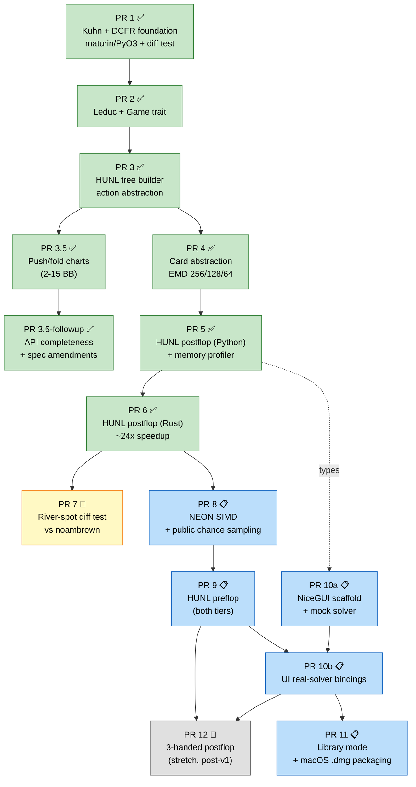
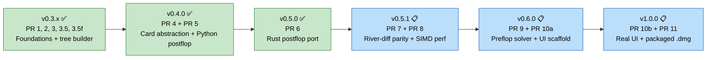
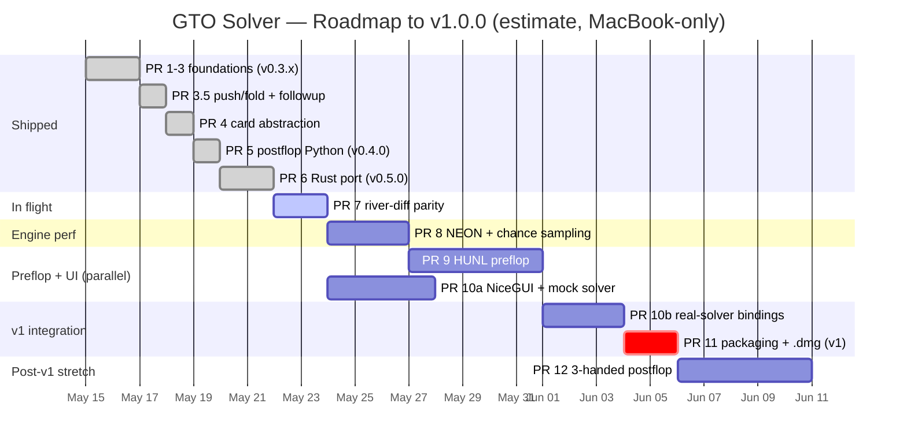

# GTO Solver Roadmap — Visual

Snapshot generated 2026-05-22. Integration tip: `6c438b8` (v0.5.0). PR 7 in flight.

Legend:
- ✅ shipped (merged to `integration`)
- 🚧 in flight (agents working)
- 📋 staged (spec'd + kickoff prompt ready)
- 📝 spec only (no impl prompts; deferred)

---

## 1. PR dependency graph

---

## 2. Version milestone mapping

---

## 3. Timeline estimate (3-4 weeks to v1)

Assumes ~1 PR landing per 2-3 days under autonomous fan-out; UI track runs in parallel with engine perf.

---

## 4. Critical path notes

The critical path runs PR 7 -> PR 8 -> PR 9 -> PR 10b -> PR 11. PR 10a (UI scaffold) parallelizes with PR 8 + PR 9 because it depends only on PR 5 data types, not on the Rust perf tier or preflop solver.

PR 12 (3-handed) is intentionally past the v1 line — flagged as approximate equilibrium (CFR has no convergence guarantee for >= 3 players), so it stays a stretch goal regardless of timeline slack.

Load-bearing caveat (carried over from PLAN §6): no production-scale HUNL solve has actually been run yet. The ✅ tags through PR 6 reflect code correctness + Rust micro-bench speedup, not the first 200K-iter MC build (~10 hr wall-clock) which is still pending.
